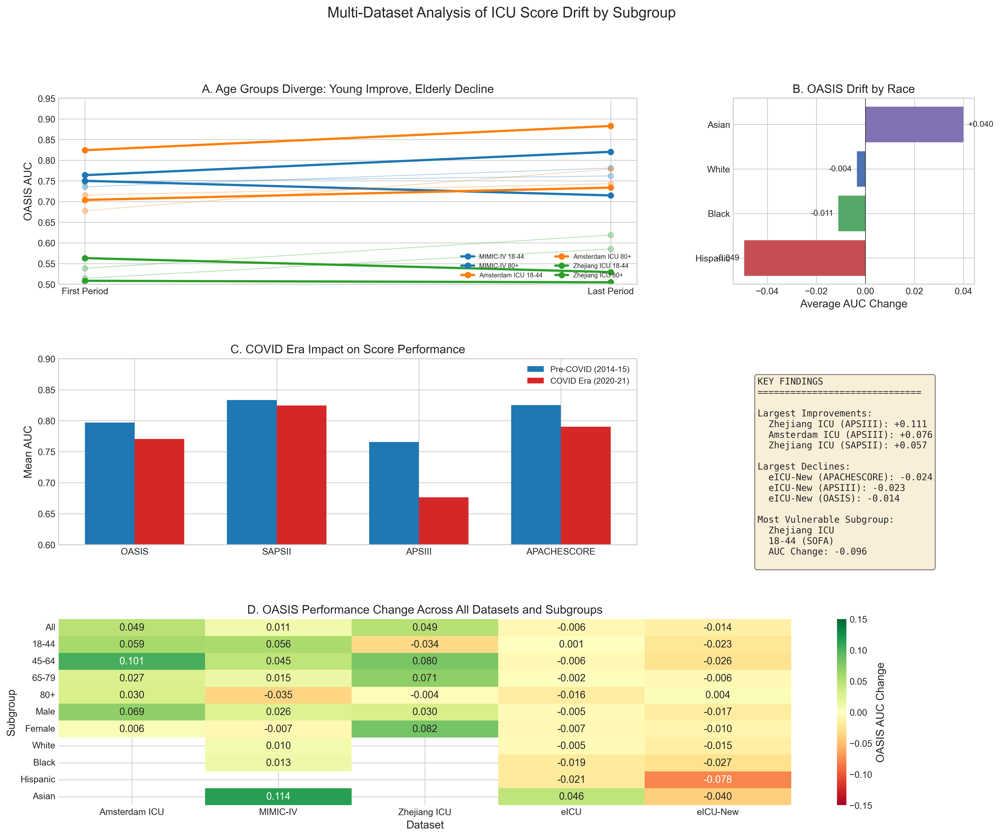

# Subgroup-Specific Drift in Clinical Prediction Models

[](https://creativecommons.org/licenses/by-nc-sa/4.0/)
[](https://github.com/sebasmos/Data-Drift)

> **TL;DR:** Does model drift affect all patient subgroups equally? We analyze SOFA score performance across demographic groups in ICU patients to test if some subgroups experience faster degradation than others.

---

## 🚀 Quick Start

### Installation

```bash
# Install uv
curl -LsSf https://astral.sh/uv/install.sh | sh  # macOS/Linux
powershell -c "irm https://astral.sh/uv/install.ps1 | iex"  # Windows

# Setup
uv venv
source .venv/bin/activate  # macOS/Linux or .venv\Scripts\activate (Windows)
uv pip install pandas numpy scikit-learn matplotlib seaborn
```

### Run Analysis

```bash
# 1. Configure dataset in code/config.py
#    ACTIVE_DATASET = 'mimic'  # or 'amsterdam_icu', 'eicu_v1', etc.

# 2. Run analysis from code directory
cd code
python mimic/01_explore_data.py
python mimic/02_drift_analysis.py

# 3. View results
# Results saved to: output/<dataset>/
```

**Note:** Scripts use `code/config.py` to determine which dataset to analyze. The generic scripts use the dataset-specific scripts internally.

---

## Results Summary

### Multi-Dataset Analysis (809,991 ICU Admissions)

We analyzed ICU severity score drift across **6 datasets** spanning **2001-2022** from the US, Europe, and Asia.

**Table 1: Dataset Overview and Overall OASIS AUC Change**

| Dataset | N | Period | Mortality | OASIS AUC Change | Direction |
|---------|---|--------|-----------|------------------|-----------|
| MIMIC-IV | 85,242 | 2008-2022 | 10.9% | +0.011 | Improving |
| Amsterdam | 27,259 | 2013-2021 | 7.9% | +0.049 | Improving |
| Zhejiang | 7,932 | 2011-2022 | 14.7% | +0.049 | Improving |
| eICU | 289,503 | 2014-2015 | 8.7% | -0.006 | Stable |
| eICU-New | 371,855 | 2020-2021 | 12.7% | -0.014 | Declining |

**Table 2: Subgroup-Specific OASIS AUC Change (First to Last Period)**

| Subgroup | MIMIC-IV | Amsterdam | Zhejiang | eICU | eICU-New |
|----------|----------|-----------|----------|------|----------|
| **Age 18-44** | +0.056 | +0.059 | -0.034 | +0.001 | -0.023 |
| **Age 80+** | -0.035 | +0.030 | -0.004 | -0.016 | +0.004 |
| **Male** | +0.026 | +0.069 | +0.030 | -0.005 | -0.017 |
| **Female** | -0.007 | +0.006 | +0.082 | -0.007 | -0.010 |
| **White** | +0.010 | - | - | -0.005 | -0.015 |
| **Black** | +0.013 | - | - | -0.019 | -0.027 |
| **Hispanic** | - | - | - | -0.021 | **-0.078** |
| **Asian** | **+0.114** | - | - | +0.046 | -0.040 |

### Key Findings

1. **COVID-era decline**: eICU-New (2020-21) shows universal performance drops vs eICU (2014-15)
2. **Hispanic patients most affected**: -0.078 AUC in COVID era (largest decline)
3. **Asian patients improved most**: +0.114 AUC in MIMIC-IV over 14 years
4. **Age divergence**: Young (18-44) improve while elderly (80+) decline in most datasets

### Key Figures


*Figure 1: Overall score performance trends across datasets*


*Figure 2: Age-stratified drift showing diverging trajectories*


*Figure 3: Summary of key findings across all datasets and subgroups*

---

## Datasets

| Dataset | Status | N | Period | Scores | Race Data |
|---------|--------|---|--------|--------|-----------|
| **MIMIC-III** | Complete | 27,226 | 2001-2008 | OASIS, SAPS-II, APS-III | Yes |
| **MIMIC-IV** | Complete | 85,242 | 2008-2022 | OASIS, SAPS-II, APS-III | Yes |
| **eICU** | Complete | 289,503 | 2014-2015 | OASIS, SAPS-II, APS-III, APACHE | Yes |
| **eICU-New** | Complete | 371,855 | 2020-2021 | OASIS, SAPS-II, APS-III, APACHE | Yes |
| **Amsterdam** | Complete | 27,259 | 2013-2021 | SOFA, OASIS, SAPS-II, APS-III | No |
| **Zhejiang** | Complete | 7,932 | 2011-2022 | SOFA, OASIS, SAPS-II, APS-III | No |

---

## 📂 Project Structure

```
Data-Drift/
├── code/                           # Analysis code
│   ├── config.py                   # ⚙️ Dataset configuration (EDIT THIS)
│   │
│   ├── mimic/                      # ✅ MIMIC scripts
│   │   ├── 01_explore_data.py      # Exploratory analysis
│   │   └── 02_drift_analysis.py    # Drift analysis + visualization
│   │
│   ├── eicu/                       # ⚠️ eICU placeholders
│   ├── chinese/                    # 🔜 Chinese ICU placeholders
│   └── amsterdam/                  # 🔜 Amsterdam placeholders (use mimic/ scripts)
│
├── data/                           # Datasets
│   ├── mimic/                      # ✅ MIMIC data + README
│   ├── amsterdam/                  # ✅ Amsterdam data + README
│   │   ├── salz_ml-scores_bias.csv # Dataset (27,259 patients)
│   │   └── README.md               # Complete analysis documentation
│   ├── eicu/                       # ⚠️ eICU data + TODO
│   └── chinese/                    # 🔜 Chinese data + TODO
│
├── output/                         # Generated results
│   ├── mimic/                      # MIMIC mech. vent. outputs
│   ├── mimic_mouthcare/            # ✅ MIMIC mouthcare outputs
│   └── amsterdam_icu/              # ✅ Amsterdam outputs
│       ├── amsterdam_icu_drift_analysis.png
│       ├── amsterdam_icu_yearly_performance.csv
│       ├── amsterdam_icu_gender_performance.csv
│       └── amsterdam_icu_age_performance.csv
│
└── reference/                      # Reference materials
    ├── sql/                        # SOFA computation SQL
    └── notebooks/                  # Exploratory notebooks
```

---

## 🔬 Methodology

### SOFA Score (Sequential Organ Failure Assessment)

Evaluates 6 organ systems:
- **Respiratory** (PaO2/FiO2 ratio)
- **Cardiovascular** (Mean arterial pressure, vasopressors)
- **Renal** (Creatinine, urine output)
- **Coagulation** (Platelets)
- **Liver** (Bilirubin)
- **Neurological** (Glasgow Coma Scale)

**Range:** 0-24 (higher = worse organ failure)

### Analysis Pipeline

**Step 1: Exploratory Analysis** (`01_explore_data.py`)
- Load and validate dataset
- Check outcome distributions
- Verify SOFA scores
- Analyze demographics and clinical variables
- Assess missing data

**Step 2: Drift Analysis** (`02_drift_analysis.py`)
- Overall SOFA performance over time
- Subgroup-stratified analyses:
  - Race (if available)
  - Gender
  - Age groups (<50, 50-65, 65-80, 80+)
  - Care frequency (if available)
- Generate visualizations + CSV outputs

### Metrics

- **AUC (Area Under ROC Curve):** Discrimination ability
  - 0.5 = random, 0.7 = acceptable, 0.8 = excellent, 1.0 = perfect
- **Accuracy:** Overall prediction accuracy
- **F1 Score:** Balance of precision and recall
- **Mortality Rate:** Observed outcome frequency

---

## ⚙️ Configuration

### Switch Datasets

Edit `code/config.py`:

```python
# Change this line to switch datasets
ACTIVE_DATASET = 'amsterdam_icu'  # Options: 'mimic', 'amsterdam_icu', 'eicu_v1', etc.
```

### Available Datasets in Config

```python
DATASETS = {
    'mimic': {...},                    # MIMIC mechanical ventilation
    'mimic_mouthcare': {...},          # MIMIC mouthcare cohort
    'eicu_v1': {...},                  # eICU sepsis v1
    'eicu_v2': {...},                  # eICU sepsis v2
    'amsterdam_icu': {...},            # ✅ Amsterdam ICU (2013-2021)
    'chinese_icu': {...},              # Chinese ICU (pending)
}
```

### Customize Analysis Parameters

```python
ANALYSIS_CONFIG = {
    'min_sample_size': 30,             # Minimum patients per subgroup
    'age_bins': [0, 50, 65, 80, 200],  # Age group boundaries
    'age_labels': ['<50', '50-65', '65-80', '80+'],
    'care_quartiles': 4,               # Care frequency quartiles
    'figure_dpi': 300,                 # Output resolution
    'figure_size': (16, 10),           # Figure dimensions
}
```

---

## 📈 Outputs

Each analysis generates in `output/<dataset>/`:

### Visualizations
- `<dataset>_drift_analysis.png` - Multi-panel figure with:
  - Overall SOFA performance over time
  - Race-stratified trends (if available)
  - Gender-stratified trends
  - Age group-stratified trends
  - Care frequency trends (if available)

### CSV Files
- `<dataset>_yearly_performance.csv` - Overall metrics by year
- `<dataset>_race_performance.csv` - Race-stratified (if available)
- `<dataset>_gender_performance.csv` - Gender-stratified
- `<dataset>_age_performance.csv` - Age-stratified
- `<dataset>_care_performance.csv` - Care frequency (if available)

**Columns in CSV files:**
- `AUC`, `Accuracy`, `F1`, `N`, `Mortality_Rate`, `Mean_Score`, `Period`, `[Subgroup]`

---

## 🔄 Running Analyses

### MIMIC Dataset

```bash
cd code
# Edit config.py: ACTIVE_DATASET = 'mimic'
python mimic/01_explore_data.py
python mimic/02_drift_analysis.py
# Results in: output/mimic/
```

### Amsterdam Dataset

```bash
cd code
# Edit config.py: ACTIVE_DATASET = 'amsterdam_icu'
python mimic/01_explore_data.py
python mimic/02_drift_analysis.py
# Results in: output/amsterdam_icu/
```

**Note:** Amsterdam uses the MIMIC scripts - they are dataset-agnostic and read from `config.py`.

### eICU Dataset (After SOFA Computation)

```bash
cd code
# Edit config.py: ACTIVE_DATASET = 'eicu_v1'
python mimic/01_explore_data.py  # Reuse MIMIC scripts
python mimic/02_drift_analysis.py
```

---

## 📊 Key Findings

### Amsterdam vs MIMIC Comparison

| Feature | Amsterdam ICU | MIMIC (Mech. Vent.) |
|---------|---------------|---------------------|
| **Overall Trend** | ⬆️ **Improving** (+0.034 AUC) | ⬇️ **Declining** |
| **Population** | General ICU | Mechanical ventilation only |
| **Mortality** | 7.9% (low) | 20-30% (high) |
| **Best Subgroup** | <50 years (+0.160 AUC) | Varies |
| **Worst Subgroup** | 65-80 years (-0.019 AUC) | Varies |
| **Gender Pattern** | Female advantage | Mixed |
| **Race Data** | ❌ Not available | ✅ Available |

### Critical Insights

1. **Opposite Drift Patterns**
   - Amsterdam: SOFA performance **improving** over time
   - MIMIC: SOFA performance **declining** over time
   - **Hypothesis:** Different patient populations (general ICU vs high-acuity ventilated)

2. **Age-Specific Heterogeneity** (Amsterdam)
   - Younger patients (<50): Exceptional improvement (+24%)
   - Middle-aged (65-80): Only declining group (-2.7%)
   - **Implication:** Age-specific recalibration may be needed

3. **COVID-19 Impact** (Amsterdam)
   - 2020-2021 vs 2017-2019 peak: -0.036 AUC
   - 38% reduction in patient volume
   - Higher severity (mean SOFA +0.15)

4. **Gender Disparity** (Amsterdam)
   - Females consistently outperform males (7/9 years)
   - Gap averages +0.04 to +0.07 AUC
   - **Requires further investigation**

---

## 📝 Documentation

### Dataset-Specific Documentation

**Amsterdam ICU:**
- [README.md](data/amsterdam/README.md) - Complete analysis results and documentation

**MIMIC:**
- [README.md](data/mimic/README.md) - Dataset information

**eICU:**
- [TODO.md](data/eicu/TODO.md) - Setup instructions

**Chinese ICU:**
- [TODO.md](data/chinese/TODO.md) - Pending setup

---

## 🛠️ Adding New Datasets

### Step 1: Prepare Data
Place CSV file in `data/<dataset>/` with required columns:
- **Outcome:** Binary mortality indicator
- **SOFA:** Pre-computed or to be computed
- **Year:** Temporal variable
- **Demographics:** Age, gender, race (optional)

### Step 2: Update Config
Add entry to `code/config.py`:

```python
'your_dataset': {
    'name': 'Dataset Name',
    'data_path': r'path/to/data',
    'file': 'data.csv',
    'outcome_col': 'death',
    'outcome_positive': 1,
    'score_col': 'sofa',
    'year_col': 'year',
    'year_bins': None,  # or ['2010-2012', '2013-2015', ...]
    'demographic_cols': {
        'race': 'race_col',
        'gender': 'gender_col',
        'age': 'age_col'
    },
    'clinical_cols': {...},
    'has_precomputed_sofa': True,
    'description': 'Dataset description'
}
```

### Step 3: Run Analysis
```bash
cd code
# Edit config.py: ACTIVE_DATASET = 'your_dataset'
python mimic/01_explore_data.py
python mimic/02_drift_analysis.py
```

---

## 🔗 Resources

### SOFA Score Computation
- **SQL Code:** `reference/sql/`
- **GitHub Reference:** https://github.com/nus-mornin-lab/oxygenation_kc
- **Calculator:** https://www.mdcalc.com/calc/691/sequential-organ-failure-assessment-sofa-score

### Publications
- Vincent JL, et al. "The SOFA (Sepsis-related Organ Failure Assessment) score to describe organ dysfunction/failure." *Intensive Care Med* 1996.

---

## 📊 Status Update

### Completed
- ✅ **MIMIC (Mechanical Ventilation)** - Full analysis complete
- ✅ **MIMIC (Mouthcare)** - Full analysis complete (8,675 patients, 2008-2019)
  - Key finding: Care frequency drift (+0.146 AUC for low-frequency care)
  - Racial disparities identified (Black patients: -0.106 AUC)
- ✅ **Amsterdam ICU** - Full analysis complete (27,259 patients, 2013-2021)
  - Key finding: Improving SOFA performance (+0.034 AUC)
  - Age-specific heterogeneity (<50 years: +24% improvement)

### In Progress
- ⚠️ **eICU v1 & v2** - Needs SOFA score computation (Emma)

### Pending
- 🔜 **Chinese ICU** - Awaiting data (Ziyue)

### Future Work
- Multi-score validation (SAPS II, OASIS, APACHE III for Amsterdam)
- COVID-19 deep dive analysis
- Cross-dataset drift comparison paper
- Machine learning model benchmarking

---

## 📝 Citation

```bibtex
@software{data_drift_2025,
  title={Subgroup-Specific Drift in Clinical Prediction Models},
  author={Hamza and Xiaoli and Celi, Leo Anthony and Cajas Ord{\'o}{\~n}ez, Sebasti{\'a}n Andr{\'e}s},
  year={2025},
  url={https://github.com/HamzaNabulsi/Data-Drift}
}
```

See [CITATION.cff](CITATION.cff) for full metadata.

---

## ⚖️ License

[](https://creativecommons.org/licenses/by-nc-sa/4.0/)

[CC BY-NC-SA 4.0](https://creativecommons.org/licenses/by-nc-sa/4.0/)

---