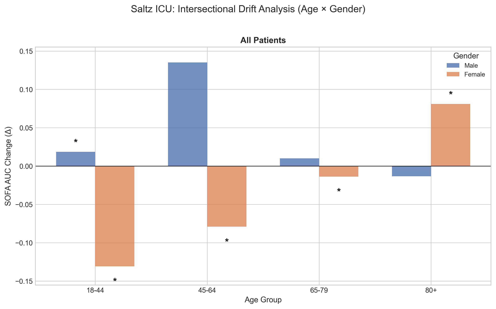
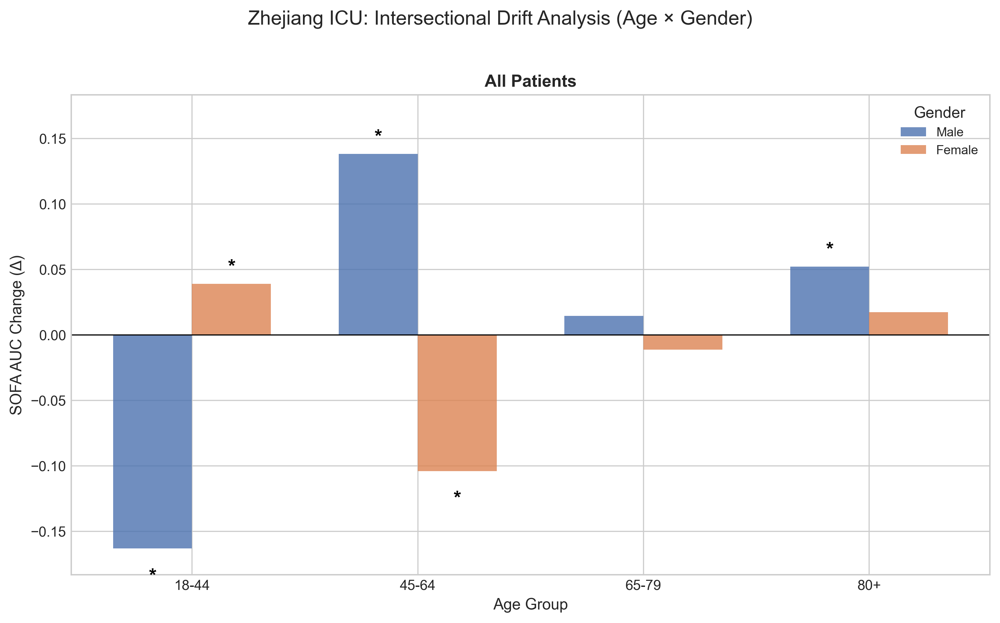
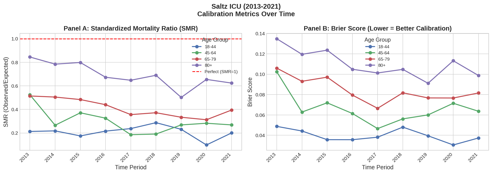
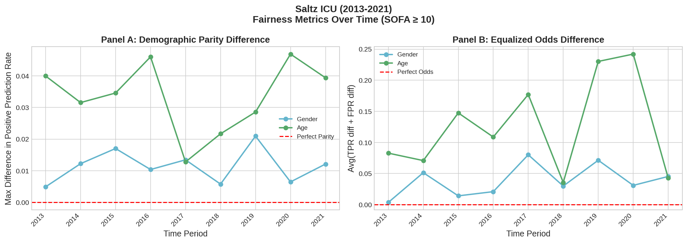
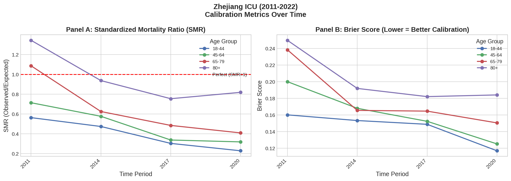
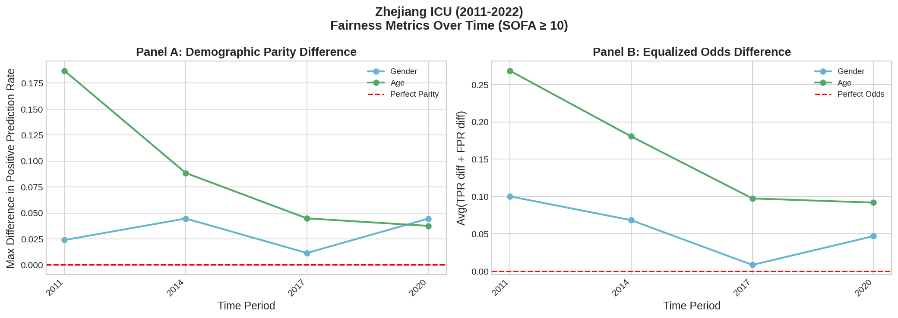
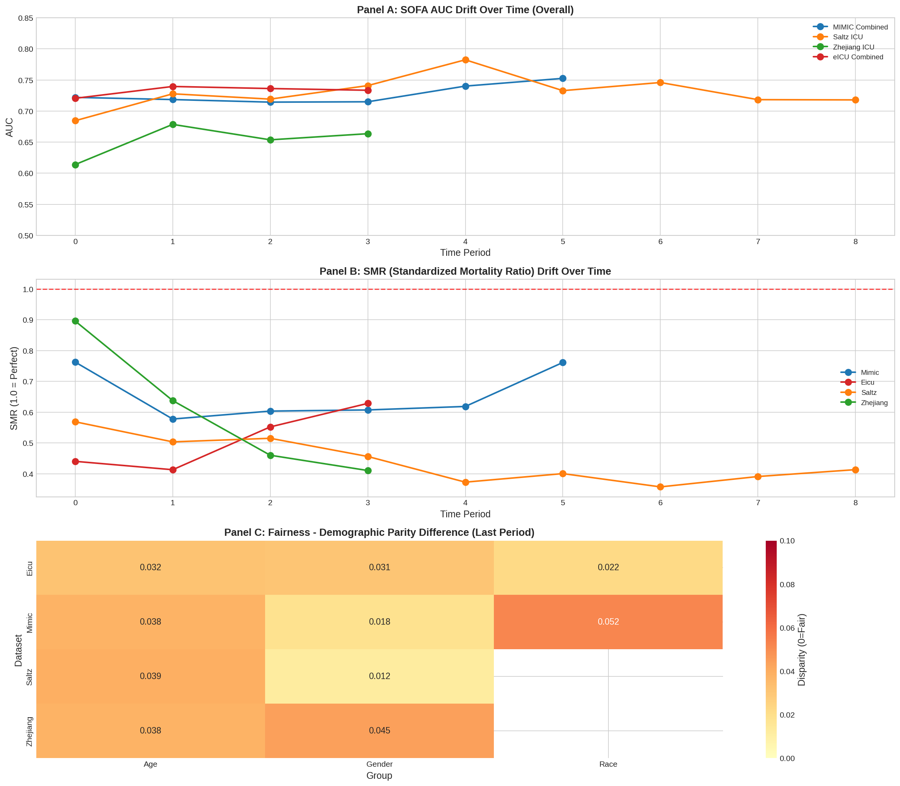

# Subgroup-Specific Drift in ICU Severity Scores

[](https://creativecommons.org/licenses/by-nc-sa/4.0/)
[](https://github.com/sebasmos/Data-Drift)

> **TL;DR:** ICU severity scores (SOFA, OASIS, SAPS-II, APS-III) drift differently across demographic subgroups. Overall improvement masks targeted degradation in minority and intersectional groups. We analyze 809,017 ICU admissions across 4 datasets from the US, Europe, and Asia (2001-2022).

---

## Table of Contents

1. [Core Hypothesis & Key Findings](#core-hypothesis--key-findings)
2. [Reproducibility](#reproducibility)
3. [Part 1: Severity Score Drift](#part-1-severity-score-drift)
   - [Datasets](#datasets)
   - [Statistical Methods](#statistical-methods)
   - [Results](#results)
   - [Figures](#figures)
4. [Part 2: Sepsis Mortality ML Model](#part-2-sepsis-mortality-ml-model-tbd)
5. [Part 3: Care Phenotypes](#part-3-care-phenotypes)
6. [Citation](#citation)

---

## Core Hypothesis & Key Findings

> **Model drift affects demographic subgroups NON-UNIFORMLY.** Uniform recalibration strategies would fail to address subgroup-specific disparities.

Our analysis confirms this across all 4 datasets:

1. **Overall improvement masks minority degradation.** In eICU, overall SOFA improves (+0.013, p < 0.001), but 18-44 Male Black patients degrade by -0.157 (p < 0.001) — a 0.482 AUC spread between best and worst intersectional groups.
2. **Between-group drift is statistically significant.** Hispanic SOFA drift is significantly worse than White drift (Δ = -0.051, FDR p < 0.001). 85-91% of between-group comparisons are significant across all datasets.
3. **Young and elderly patients experience opposite drift directions** — a pattern consistent across US, European, and Asian datasets.
4. **The same subgroup can improve in one healthcare system while declining in another** — no single recalibration factor works universally.

---

## Reproducibility

### Quick Start

**Requirements:** Python 3.10+, [uv](https://github.com/astral-sh/uv) (`pip install uv`), dataset CSVs in `data/` (see [Data README](data/README.md))

```bash
# Setup
uv venv && source .venv/bin/activate && uv pip install -r requirements.txt

# Run full pipeline
./run_all.sh --fast       # Fast testing (~1 min, 2 bootstrap iterations)
./run_all.sh              # Default (~15 min, 100 iterations)
./run_all.sh -b 1000      # Production (~2-4 hours, 1000 iterations)

# Individual steps
./run_all.sh --setup      # Only setup environment
./run_all.sh --analysis   # Only run analysis
./run_all.sh --figures    # Only generate figures
```

<details>
<summary>Windows (PowerShell)</summary>

```powershell
uv venv && .venv\Scripts\activate && uv pip install -r requirements.txt
python code/batch_analysis.py --fast
python code/supplementary_analysis.py --fast
python code/generate_all_figures.py
```
</details>

### Project Structure

```
Data-Drift/
├── code/
│   ├── batch_analysis.py         # Main analysis pipeline
│   ├── generate_all_figures.py   # Figure generation
│   ├── supplementary_analysis.py # Care phenotype analysis
│   ├── config.py                 # Dataset configurations
│   ├── create_report.py          # Word report generation
│   └── tests/                    # Statistical method validation (19 tests)
├── data/                         # Dataset CSVs (see data/README.md)
├── figures/                      # Generated figures
│   └── supplementary/            # Supplementary figures
├── output/                       # Per-dataset analysis results
│   └── {dataset}/
│       ├── drift_results.csv              # Per-period AUC with 95% CIs
│       ├── drift_deltas.csv               # Trend test results (FDR-corrected)
│       ├── between_group_comparisons.csv  # Between-group drift tests
│       ├── summary_by_score.csv           # Overall summary
│       └── subgroup_drift.csv             # Subgroup-level results
├── run_all.sh                    # Reproducibility script
└── requirements.txt
```

---

## Part 1: Severity Score Drift

### Datasets

| Dataset | N | Period | Mortality | Scores | Race | Source |
|---------|---|--------|-----------|--------|------|--------|
| MIMIC Combined | 112,468 | 2001-2022 | 11.1% | SOFA, OASIS, SAPS-II, APS-III | Yes | US (Boston) |
| eICU Combined | 661,358 | 2014-2021 | 10.9% | SOFA, OASIS, SAPS-II, APS-III, APACHE | Yes | US (Multi-center) |
| Saltz | 27,259 | 2013-2021 | 7.9% | SOFA, OASIS, SAPS-II, APS-III | No | Europe (Netherlands) |
| Zhejiang | 7,932 | 2011-2022 | 14.7% | SOFA, OASIS, SAPS-II, APS-III | No | Asia (China) |

**Total: 809,017 ICU admissions.** Each dataset analyzed independently — no cross-dataset statistical comparisons. SOFA used as primary metric.

### Statistical Methods

| Method | Purpose | Implementation |
|--------|---------|----------------|
| **Bootstrap CIs** | Confidence intervals for AUC | Percentile method, stratified resampling (n=100-1000) |
| **Page's L trend test** | Monotonic AUC trends across all ordered time periods | Two-sided test on bootstrap replicates (`scipy.stats.page_trend_test`) |
| **Between-group comparison** | Test whether drift differs between subgroups | Mann-Whitney U on bootstrap delta distributions (`scipy.stats.mannwhitneyu`) |
| **FDR correction** | Control false discovery rate | Benjamini-Hochberg (`scipy.stats.false_discovery_control`), p < 0.05 |

Page's trend test uses data from **all intermediate time periods** (not just first vs. last), detecting consistent trends that endpoint comparisons miss. Between-group tests answer whether one group's drift is significantly different from another's.

### Results

#### Overall Drift (All Scores)

| Dataset | SOFA | OASIS | SAPS-II | APS-III | APACHE | Significant |
|---------|------|-------|---------|---------|--------|-------------|
| MIMIC | **+0.031*** ↑ | **+0.006*** ↑ | **-0.002*** ↑ | **+0.031*** ↑ | — | 81/95 (85.3%) |
| eICU | **+0.013*** ↑ | **-0.037*** ↓ | **-0.008*** ↓ | **-0.096*** ↓ | **-0.046*** ↓ | 188/215 (87.4%) |
| Saltz | **+0.034*** ↑ | **+0.049*** ↑ | **+0.054*** ↑ | **+0.076*** ↑ | — | 43/60 (71.7%) |
| Zhejiang | **+0.050*** ↑ | **+0.049*** ↑ | **+0.057*** ↑ | **+0.111*** ↑ | — | 45/60 (75.0%) |

*Bold\* = FDR-corrected p < 0.05. ↑/↓ = trend direction. "Significant" = total subgroup tests significant per dataset.*

#### Per-Race SOFA Trends (US Datasets)

| Dataset | Race | SOFA Δ | Direction | FDR p-value |
|---------|------|--------|-----------|-------------|
| **eICU** | White | +0.012 | Increasing | <0.001 |
| | Asian | +0.101 | Increasing | <0.001 |
| | Black | -0.002 | Decreasing | 0.036 |
| | Hispanic | -0.039 | Decreasing | <0.001 |
| **MIMIC** | White | +0.046 | Increasing | <0.001 |
| | Asian | +0.006 | Increasing | 0.002 |
| | Black | +0.026 | Increasing | 0.376 |

#### Intersectional Disparities (SOFA)

| Dataset | Overall Δ | Worst Group | Δ | Best Group | Δ | Spread |
|---------|-----------|-------------|---|------------|---|--------|
| **eICU** | +0.013 ↑ | 18-44 Male Black | -0.157 | 80+ Female Asian | +0.325 | 0.482 |
| **MIMIC** | +0.031 ↑ | 45-64 Male Black | -0.020 | 65-79 Male Black | +0.205 | 0.225 |
| **Saltz** | +0.034 ↑ | 18-44 Female | -0.131 | 45-64 Male | +0.135 | 0.266 |
| **Zhejiang** | +0.050 ↑ | 18-44 Male | -0.163 | 45-64 Male | +0.138 | 0.301 |

*All worst-group FDR p-values < 0.001.*

**eICU Top Degrading Intersectional Groups:**

| Subgroup | SOFA Δ | FDR p |
|----------|--------|-------|
| 18-44 Male Black | -0.157 | <0.001 |
| 45-64 Male Asian | -0.091 | 0.012 |
| 45-64 Female Hispanic | -0.089 | <0.001 |
| 45-64 Male Hispanic | -0.076 | <0.001 |
| 18-44 Male Hispanic | -0.062 | <0.001 |

#### Between-Group Drift Comparisons (SOFA)

Formal tests of whether one group's drift is significantly different from another's:

**eICU Race comparisons:**

| Comparison | Drift Difference | 95% CI | FDR p |
|------------|-----------------|--------|-------|
| Hispanic vs White | -0.051 | (-0.082, -0.033) | <0.001 |
| Hispanic vs Overall | -0.051 | (-0.075, -0.032) | <0.001 |
| Asian vs Overall | +0.088 | (+0.049, +0.138) | <0.001 |
| Asian vs Hispanic | +0.139 | (+0.092, +0.203) | <0.001 |

**Between-group significance rates:**

| Dataset | Significant / Total | Rate |
|---------|---------------------|------|
| eICU | 48/55 | 87.3% |
| MIMIC | 29/32 | 90.6% |
| Saltz | 18/21 | 85.7% |
| Zhejiang | 18/21 | 85.7% |

### Figures

#### Main Figures (Paper)

**Figure 1: MIMIC Combined (US, 2001-2022)**


*4-panel: Age, Gender, Race drift + intersectional AUC trends (21 years, 6 periods)*


*Intersectional drift (Age × Gender × Race)*

**Figure 2: eICU Combined (US, 2014-2021)**


*4-panel: Age, Gender, Race drift + intersectional AUC trends (7 years, 4 periods)*


*Intersectional drift — young minority males show severe degradation during COVID era*

**Figure 3: Saltz (Netherlands, 2013-2021)**


*4-panel: European dataset, no race data (9 years, 9 periods)*


*Intersectional drift (Age × Gender)*

**Figure 4: Zhejiang (China, 2011-2022)**


*4-panel: Asian dataset, no race data (11 years, 4 periods)*


*Intersectional drift (Age × Gender)*

**Figure 5: Summary (Money Figure)**


*Multi-panel summary: age group divergence, race disparities, comprehensive heatmap*

**Figure 6: Between-Group Drift Comparison**


*Forest plot of between-group drift differences (SOFA, Mann-Whitney U, FDR-corrected)*

**Figure 7: Significance Forest Plot**


*Statistically significant drift findings ranked by effect size with 95% CIs*

#### Supplementary Figures

<details>
<summary>Classification, Calibration & Fairness Metrics (per dataset)</summary>

**MIMIC Combined:**


*Classification metrics drift at SOFA ≥ 10 threshold*


*SMR and Brier Score over time*


*Fairness metrics by subgroup*

**eICU Combined:**


*Classification metrics drift at SOFA ≥ 10 threshold*


*SMR and Brier Score over time*


*Fairness metrics by subgroup*

**Saltz:**


*Classification metrics drift at SOFA ≥ 10 threshold*


*SMR and Brier Score over time*


*Fairness metrics by subgroup*

**Zhejiang:**


*Classification metrics drift at SOFA ≥ 10 threshold*


*SMR and Brier Score over time*


*Fairness metrics by subgroup*

</details>

<details>
<summary>3-Panel Summary (Classification + Calibration + Fairness)</summary>


*Cross-dataset summary: AUC drift, SMR calibration, fairness heatmap*

</details>

---

## Part 2: Sepsis Mortality ML Model [TBD]

Evaluation of the [Early Prediction of Sepsis (EASP)](https://physionet.org/content/challenge-2019/1.0.0/) ML model drift across the same datasets and subgroups. Extends Part 1 from severity scores (non-prediction) to a trained prediction model.

**Status:** Milit is developing this analysis. Key findings so far:
- Patient-level evaluation raises AUROC from ~0.55 to 0.664 (MIMIC), 0.753 (eICU 2014-15), 0.702 (eICU 2020-21)
- Younger Black and Hispanic patients are better discriminated by the model than older White patients
- Label timing mismatch and domain shift identified as compounding issues

Code and figures will be integrated into this repository once complete.

---

## Part 3: Care Phenotypes

Care phenotypes use **nursing care intensity patterns** as a proxy for unmeasured intersectional factors (socioeconomic status, insurance, language barriers). This captures how the healthcare system *perceives* a patient — beyond traditional demographic labels. See [Care Phenotypes Documentation](docs/care_phenotypes.md).

**MIMIC-IV Subsets:**

| Dataset | N | Period | Mortality | Analysis Focus |
|---------|---|--------|-----------|----------------|
| MIMIC-IV Mouthcare | 8,675 | 2008-2019 | ~30% | Oral care frequency |
| MIMIC-IV Mech. Vent. | 8,919 | 2008-2019 | ~30% | Turning frequency |


*SOFA drift by age, race, gender, and oral care frequency quartile*


*SOFA drift by age, race, gender, and mechanical ventilation turning frequency quartile*

---

## Citation

```bibtex
@software{data_drift_2025,
  title={Subgroup-Specific Drift in ICU Severity Scores},
  author={Nabulsi, Hamza and Liu, Xiaoli and Celi, Leo Anthony and Cajas, Sebastian},
  year={2025}
}
```

## License

[CC BY-NC-SA 4.0](https://creativecommons.org/licenses/by-nc-sa/4.0/)
